# Kanana Schedule Agent 프로젝트 전체 구조

이 문서는 LLM과 Agent를 공부하는 학생들이 프로젝트를 처음 열었을 때 전체 구조와 학습 흐름을 빠르게 파악하기 위한 지도입니다. 실행 방법과 검증 명령은 [README.md](README.md)를 기준으로 보고, 이 문서는 "어느 파일이 어떤 역할을 하는지"를 이해하는 데 집중합니다.

## 30초 요약

| 경로 | 한 줄 역할 |
| --- | --- |
| `app.py` | Gradio 기반 채팅 UI 진입점입니다. |
| `CURRICULUM.md` | 6주 / 총 12회 수업의 주차별 미션 운영안을 정리합니다. |
| `fixed/agent_runtime.py` | 대화 저장과 active-week student agent 호출을 담당하는 얇은 런타임입니다. |
| `student_parts/` | 수강생이 주차별로 구현 흐름을 확인하고 수정하는 핵심 폴더입니다. |
| `fixed/stores.py` | 역할별 저장소 모듈을 다시 내보내는 호환 wrapper입니다. |
| `golden_cases.py`, `tests/`, `run_golden.py` | 프롬프트 하네스와 전체 시나리오가 기대대로 동작하는지 검증합니다. |

## 전체 실행 흐름



메인 채팅 화면의 런타임은 UI 입력과 대화 저장만 담당합니다. `run.sh --weekN` 또는 `KANANA_ACTIVE_WEEK`로 선택된 주차의 `student_parts` agent가 사용자 프롬프트를 읽고 자기 prompt와 tool 목록을 기준으로 structured output, 일정 CRUD, SQLite 저장/조회, RAG 검색, MCP 검색, 그룹 일정 제안을 수행합니다. Week 1-5는 단일 agent가 해당 주차까지 누적된 tool을 사용하고, Week 6은 supervisor가 `nana_agent` 또는 `kana_agent` tool로 위임합니다. 코드가 의미 판단을 선점하지 않고, 저장소와 MCP는 LLM이 고른 tool 호출을 실행하는 얇은 실행 계층으로 둡니다. `run_golden.py`는 API key 없이도 하네스 프롬프트가 agent prompt와 tool wiring에 연결되어 있는지 검증합니다.

## 폴더 지도

| 경로 | 역할 | 수강생이 봐야 할 포인트 | 직접 수정 여부 |
| --- | --- | --- | --- |
| `README.md` | 실행법, 환경 변수, 검증 명령 안내 | 프로젝트를 처음 실행할 때 먼저 확인합니다. | 보통 수정하지 않음 |
| `CURRICULUM.md` | 6주 / 총 12회 수업 계획 | 각 Week의 미션, 코드 흐름, 검증 포인트를 확인합니다. | 문서 개선 시 수정 가능 |
| `PROJECT_OVERVIEW.md` | 전체 구조와 학습 흐름 안내 | 파일 간 관계를 파악할 때 봅니다. | 문서 개선 시 수정 가능 |
| `app.py` | Gradio UI, 채팅/상세 탭, trace 표시 | 입력이 런타임으로 들어가고 결과가 화면에 나오는 흐름을 확인합니다. | 보통 수정하지 않음 |
| `student_parts/` | Week 1-6 수강생 구현 파일 | 학생용 repo/branch에서는 파일 최상단 `[수강생 구현 가이드]`를 읽고 핵심 `@tool` 함수의 TODO 본문을 구현합니다. 입력 정리, 저장소/MCP 호출, JSON 반환까지 한 구현 단위로 구성합니다. | 예 |
| `fixed/agent_runtime.py` | active-week agent 런타임 | 채팅 입력이 선택된 주차 agent로 들어가고 trace가 수집되는 흐름을 확인합니다. | 보통 수정하지 않음 |
| `fixed/store_base.py`, `fixed/app_store.py`, `fixed/external_people_store.py`, `fixed/reference_store.py` | SQLite/Chroma 저장소 구현 | 앱 DB, 외부 멤버 DB, 개인 참고자료 저장소를 역할별로 나눠 참고합니다. `fixed/stores.py`는 기존 import 호환 wrapper입니다. | 보통 수정하지 않음 |
| `fixed/config.py` | `.env`, DB 경로, 모델 설정 | 실행 환경 설정이 어디에서 로드되는지 확인합니다. | 필요 시 강사와 함께 수정 |
| `fixed/trace.py` | tool call/result trace 수집 | 상세 탭에 표시되는 trace 구조를 확인합니다. | 보통 수정하지 않음 |
| `mcp_server/` | Week 5 MCP SQLite server | 외부 대화 검색 tool이 MCP로 노출되는 방식을 봅니다. 학생 구현 대상은 아닙니다. | 보통 수정하지 않음 |
| `data/` | 앱 DB, 외부 인물 DB, Chroma 데이터 | SQLite/Chroma 저장 결과를 이해할 때 참고합니다. | 직접 편집하지 않음 |
| `static/` | CSS와 Kanana 브랜드 이미지 | 화면 스타일과 브랜드 자산을 확인합니다. | UI 수업이 아니면 수정하지 않음 |
| `tests/` | pytest 하네스/agent 테스트 | 프롬프트 하네스와 prompt-driven agent trace 형식을 확인합니다. | 테스트 추가 시 수정 가능 |
| `run_golden.py`, `golden_cases.py` | 전체 golden scenario 검증 | 핵심 프롬프트 하네스가 통과하는지 확인합니다. | 보통 수정하지 않음 |
| `run.sh` | 설치, 실행, 테스트 명령 래퍼 | 수업 중 사용하는 표준 실행 명령을 확인합니다. | 보통 수정하지 않음 |

## 주차별 학습 흐름

| 주차 | 파일 | 핵심 개념 | 구현/확인 포인트 |
| --- | --- | --- | --- |
| Week 1 | `student_parts/week01_wake_up_nana.py` | LangChain tool 기초 | 상단 가이드가 지정한 3개 개인 일정 tool을 구현하고, `week01_tools()`가 이를 공개합니다. |
| Week 2 | `student_parts/week02_structure_natural_language_requests.py` | Structured output | `week02_tools()`가 Week 1 도구에 structured output tool을 누적하고 Week 2 agent가 이를 선택합니다. |
| Week 3 | `student_parts/week03_build_nanas_logbook.py` | SQLite persistence | `week03_tools()`가 Week 1-2 도구에 SQLite 저장/조회/삭제 tool을 누적합니다. |
| Week 4 | `student_parts/week04_retrieve_nanas_memory.py` | Agentic RAG | `week04_tools()`가 Week 1-3 도구에 course repo 기준 RAG 검색 tool인 `search_personal_references`, `search_saved_requests`를 누적합니다. |
| Week 5 | `student_parts/week05_load_kanas_past_conversations.py`, `mcp_server/sqlite_mcp_server.py` | MCP tool 연결 | `week05_tools()`가 Week 1-4 도구에 외부 대화/일정 추출 tool을 누적합니다. |
| Week 6 | `student_parts/week06_kanamate_decides_schedule.py` | Supervisor / sub-agent | `build_week_agent()`가 supervisor를 실행하고, `nana_agent`, `kana_agent`가 이전 주차 tool 목록을 역할별로 조립합니다. |

주차가 올라갈수록 앞 주차의 결과를 재사용합니다. Week 1은 단독 구현이고, Week 2는 Week 1 도구를 포함하며, Week 3은 Week 1-2 도구를 포함하는 식으로 누적됩니다. 최종 Week 6의 `kana_agent`는 Week 5의 외부 일정 검색 결과를 사용하고, `nana_agent`는 Week 1/3/4의 개인 일정 생성, 저장, 검색 흐름을 사용합니다.

각 주차는 실제 Week 코드가 공개하는 tool, payload, 저장소, trace 흐름을 하나의 미션으로 다룹니다. 자세한 운영안은 [CURRICULUM.md](CURRICULUM.md)를 봅니다.

## 처음 보는 수강생의 추천 탐색 순서

1. [README.md](README.md)에서 실행 방법과 환경 변수를 확인합니다.
2. 이 문서의 "30초 요약"과 "전체 실행 흐름"을 먼저 봅니다.
3. `student_parts/weekXX_*.py` 파일을 열고 최상단 `[수강생 구현 가이드]`와 핵심 `@tool` 함수의 `# [STUDENT TODO]` 주석을 찾습니다. 구현은 해당 TODO tool 본문 하나 안에서 완료합니다.
4. `./run.sh --week1`로 시작하고, 주차가 올라가면 `./run.sh --week2`처럼 선택합니다.
5. `./run.sh --test` 또는 `./run.sh --golden`으로 전체 기준본이 통과하는지 확인합니다.
6. 앱을 실행한 뒤 "상세" 탭에서 마지막 Agent 실행 trace를 확인합니다.

Week 4의 개인 참고자료 add/search는 ChromaDB collection과 OpenAI 호환 embedding proxy adapter를 사용하므로 `.env`에 실제 `PROXY_TOKEN`이 있어야 reference add/search가 동작합니다. `OPENAI_EMBEDDING_MODEL`을 바꾸면 새 embedding collection 기준으로 참고자료를 다시 쌓아야 할 수 있습니다. Week 4 tool 결과의 `reference_backend`에서 vector store, embedding model, embedding base URL을 확인할 수 있습니다.

## 자주 쓰는 명령

```bash
./run.sh
```

Week 1 Gradio 앱을 실행합니다.

```bash
./run.sh --week6
```

선택한 주차의 Gradio 앱을 실행합니다.

```bash
./run.sh --test
```

API key 없이 통과해야 하는 오프라인 pytest를 실행한 뒤 golden scenario를 이어서 확인합니다.

```bash
./run.sh --integration-test
```

실제 `PROXY_TOKEN`이 있을 때 Week 2 structured output과 Week 4 embedding/RAG 통합 테스트를 실행합니다.

```bash
./run.sh --golden
```

수업 검증용 prompt harness wiring만 실행합니다.

## 읽는 팁

- 먼저 `student_parts/`를 보고, 더 깊은 동작이 궁금할 때 `fixed/`를 따라가면 됩니다.
- 앱 화면에서 어떤 tool이 호출됐는지 궁금하면 "상세" 탭의 trace를 보면 됩니다.
- DB를 직접 고치기보다는 tool과 store 함수가 어떤 데이터를 읽고 쓰는지 코드로 추적하는 편이 안전합니다.
